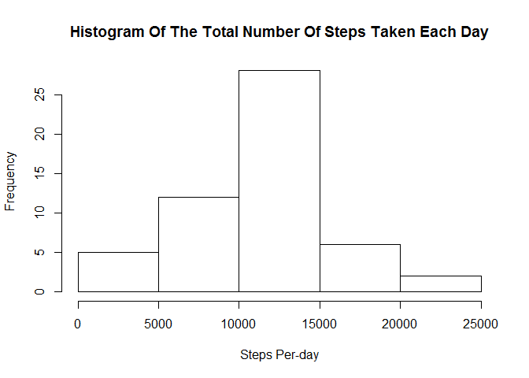
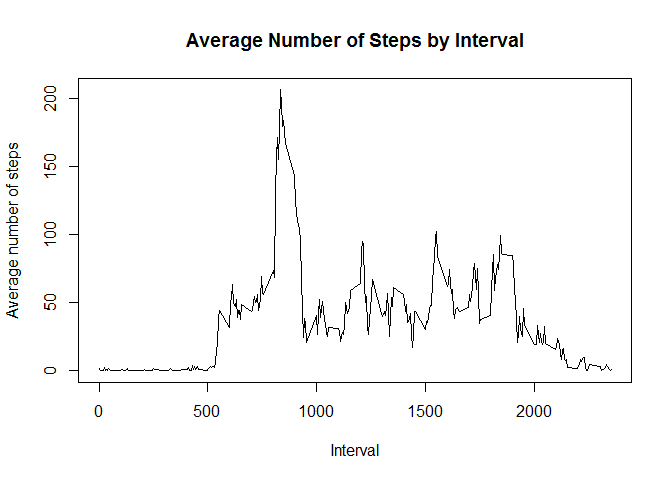
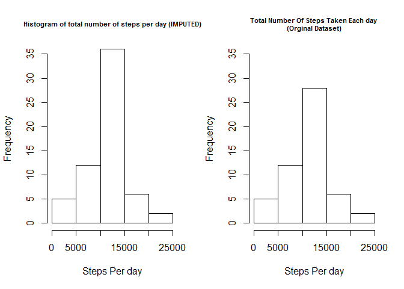
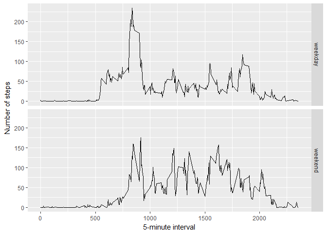

# Reproducible Research: Peer Assessment 1


## Loading and preprocessing the data

Show any code that is needed to  
  
1. Load the data (i.e. read.csv())    
2. Process/transform the data (if necessary) into a format suitable for your analysis  


```r
# Set environment data file
setwd("D:\\Data Scientist\\Module 5\\RepData_PeerAssessment1")
```


```r
# Include library
library(dplyr)
```


```r
#load data file into data frame
activity <- read.csv("activity.csv", as.is = TRUE)
```


```r
# remove NA values
clean_steps <- activity[complete.cases(activity), ]
```

## What is mean total number of steps taken per day?

For this part of the assignment, you can ignore the missing values in the dataset.  
  
1. Calculate the total number of steps taken per day  
2. If you do not understand the difference between a histogram and a barplot, research the difference between them. Make a histogram of the total number of steps taken each day  
3. Calculate and report the mean and median of the total number of steps taken per day    


```r
# Calculate the total number of steps taken per day
perday <- group_by(clean_steps, date)
steps_perday <- summarise(perday, total = sum(steps))
```


```r
# Plot Histogram of the total number of steps taken each day
hist(steps_perday$total, main = "Histogram Of The Total Number Of Steps Taken Each Day", xlab = "Steps Per-day")
```

<!-- -->


```r
# Calculate mean and medium
mean(steps_perday$total)
```

```
## [1] 10766.19
```

```r
median(steps_perday$total)
```

```
## [1] 10765
```
The mean and median of the total number per day are 10766.19 and 10765 as shown above

## What is the average daily activity pattern?
1. Make a time series plot (i.e. type = "l") of the 5-minute interval (x-axis) and the average number of steps taken, averaged across all days (y-axis)  
2. Which 5-minute interval, on average across all the days in the dataset, contains the maximum number of steps?  


```r
# Calculate average steps for plot 
avg_steps <- aggregate(steps ~ interval, clean_steps, mean)

# Plot the time series with appropriate labels and heading
plot(avg_steps$interval, avg_steps$steps, type='l', 
     main="Average Number of Steps by Interval", xlab="Interval", 
     ylab="Average number of steps")
```

<!-- -->


```r
# Identify the interval index which has the highest average steps
max_steps <- which.max(avg_steps$steps)

# get the interval with maximum average number of steps in an interval
avg_steps[max_steps, ]
```

```
##     interval    steps
## 104      835 206.1698
```

The 5-minute interval that contains the maximum of steps, on average across all days, is 835

## Imputing missing values

Note that there are a number of days/intervals where there are missing values (coded as NA). The presence of missing days may introduce bias into some calculations or summaries of the data.  
  
1. Calculate and report the total number of missing values in the dataset (i.e. the total number of rows with NAs)  
2. Devise a strategy for filling in all of the missing values in the dataset. The strategy does not need to be sophisticated. For example, you could use the mean/median for that day, or the mean for that 5-minute interval, etc.  
3. Create a new dataset that is equal to the original dataset but with the missing data filled in.  
4. Make a histogram of the total number of steps taken each day and Calculate and report the mean and median total number of steps taken per day. Do these values differ from the estimates from the first part of the assignment? What is the impact of imputing missing data on the estimates of the total daily number of steps?  


```r
na_steps <- activity[!complete.cases(activity), ]
nrow(na_steps)
```

```
## [1] 2304
```

The total number of rows with NA's is 2304 as shown above.  

I picked the strategy to replace the missing NA values with the average steps in that interval across all the days.  


```r
# perform imputation
for (i in 1:nrow(activity)) {
  if(is.na(activity$steps[i])) {
    steps_val <- avg_steps$steps[which(avg_steps$interval == activity$interval[i])]
    activity$steps[i] <- steps_val 
  }
}
head(activity)
```

```
##       steps       date interval
## 1 1.7169811 2012-10-01        0
## 2 0.3396226 2012-10-01        5
## 3 0.1320755 2012-10-01       10
## 4 0.1509434 2012-10-01       15
## 5 0.0754717 2012-10-01       20
## 6 2.0943396 2012-10-01       25
```


```r
# calculate  total number of steps taken each day
steps_impute <- aggregate(steps ~ date, activity, sum)
head(steps_impute)
```

```
##         date    steps
## 1 2012-10-01 10766.19
## 2 2012-10-02   126.00
## 3 2012-10-03 11352.00
## 4 2012-10-04 12116.00
## 5 2012-10-05 13294.00
## 6 2012-10-06 15420.00
```


```r
# Draw a histogram of the value 
par(mfrow=c(1,2))
hist(steps_impute$steps, main = "Histogram of total number of steps per day (IMPUTED)", xlab = "Steps Per day", ylim = c(0,35), cex.main = 0.7)

hist(steps_perday$total, main = "Total Number Of Steps Taken Each day \n(Orginal Dataset)", xlab = "Steps Per day", ylim = c(0,35), cex.main = 0.7)
```

<!-- -->


```r
# Compute the mean and median of the imputed value
# Calculate the mean and median of the total number of steps taken per day
mean(steps_impute$steps)
```

```
## [1] 10766.19
```

```r
median(steps_impute$steps)
```

```
## [1] 10766.19
```

The mean and the median has NOT changed because of the imputed values.  

##Are there differences in activity patterns between weekdays and weekends?

1. For this part the weekdays() function may be of some help here. Use the dataset with the filled-in missing values for this part.  

2. Create a new factor variable in the dataset with two levels - "weekday" and "weekend" indicating whether a given date is a weekday or weekend day.
Make a panel plot containing a time series plot (i.e. type = "l") of the 5-minute interval (x-axis) and the average number of steps taken, averaged across all weekday days or weekend days (y-axis). See the README file in the GitHub repository to see an example of what this plot should look like using simulated data.  


```r
library(ggplot2)

#Create a new factor variable in the dataset with two levels - "weekday" and "weekend" indicating whether a given date is a weekday or weekend day. 
clean_steps$day = ifelse(as.POSIXlt(as.Date(clean_steps$date))$wday%%6 == 
                              0, "weekend", "weekday")

clean_steps$day = factor(clean_steps$day, levels = c("weekday", "weekend"))

# make the panel plot for weekdays and weekends
stepsInterval = aggregate(steps ~ interval + day, clean_steps, mean)

ggplot(stepsInterval, aes(interval, steps)) + geom_line() + facet_grid(day ~ .) + 
  xlab("5-minute interval") + ylab("Number of steps")
```

<!-- -->
